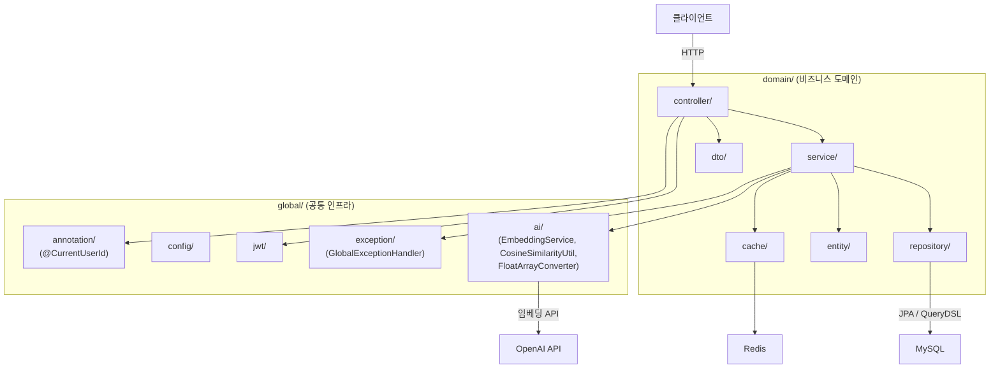

# 프로젝트 아키텍처

## 전체 구조



## 도메인 목록

| 도메인 | 설명 |
|--------|------|
| `auth` | 인증/인가 (JWT 발급, 소셜 로그인) |
| `user` | 사용자 프로필 및 관심사 |
| `place` | 장소 정보 및 검색 문서 관리 |
| `recommend` | 임베딩 기반 장소 추천 |
| `course` | 코스 큐레이션 |
| `bookmark` | 즐겨찾기 |
| `review` | 리뷰 및 요약 |
| `tag` | 태그 계층 구조 |
| `town` | 동네 정보 |
| `file` | 파일 업로드 (S3) |
| `admin` | 어드민 관리 |

## 도메인 레이어 구조

```
domain/{도메인명}/
├── controller/   # API 엔드포인트
├── service/      # 비즈니스 로직
├── entity/       # JPA 엔티티
├── repository/   # JPA / QueryDSL 리포지토리
├── dto/          # 요청/응답 DTO
└── cache/        # Redis 캐시 관련
```

## AI / 벡터 관리

- **벡터 저장:** 별도 벡터 DB 없이 MySQL `MEDIUMBLOB` + `FloatArrayConverter` 사용
- **임베딩 생성:** Spring AI 1.1.2 — `EmbeddingModel.embed(text)` → `float[]`
- **LLM 응답 파싱:** `BeanOutputConverter` 미사용 (`extra_body` 충돌), 프롬프트 기반 JSON + `ObjectMapper`로 파싱
- **유사도 계산:** `CosineSimilarityUtil`로 서버 사이드 처리

## 환경 프로파일

| 프로파일 | 설정 파일 | 비고 |
|----------|-----------|------|
| (default) | `application.yml` | MySQL(3308), Redis(6381) 로컬 |
| `dev` | `application-dev.yml` | 환경 변수 활용 (`DB_URL`, `REDIS_HOST`, `OPENAI_API_KEY` 등) |
| `prod` | `application-prod.yml` | 운영 환경, 환경 변수 활용 |

> `OPENAI_API_KEY` 등 민감 키는 `.yml`에 하드코딩하지 않고 환경 변수로 관리한다.
